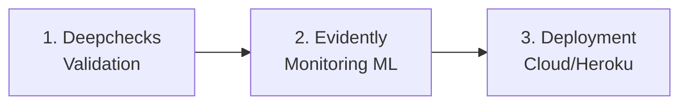

# 🚀 CrimeGuard MLOps - Command Reference
**Production Deployment & Development Commands**

---

## 📋 Table of Contents

1. [Environment Setup](#1-environment-setup)
2. [DVC - Data Version Control](#2-dvc---data-version-control)
3. [Local Development](#3-local-development)
4. [Testing Suite](#4-testing-suite)
5. [Docker & Containerization](#5-docker--containerization)
6. [Jenkins CI/CD](#6-jenkins-cicd)
7. [Kubernetes Deployment](#7-kubernetes-deployment)
8. [API Testing & Validation](#8-api-testing--validation)
9. [MLOps Pipeline Workflow](#9-mlops-pipeline-workflow)
10. [Sample Prediction Payload](#10-sample-prediction-payload)

---

## 1️⃣ Environment Setup

### Activate Python Virtual Environment (Windows)

```powershell
# Primary activation method
.\env\Scripts\Activate.ps1

# Alternative activation
.\env\Scripts\Activate
```

### Install Project Dependencies

```bash
pip install -r requirements.txt
```

---

## 2️⃣ DVC - Data Version Control

### Track Data Files with DVC

```bash
# Add DVC tracked files to Git
git add data.dvc .gitignore
git commit -m "Track /data with DVC"
git push
```

### Configure DVC Remote (DagsHub)

```bash
# Add DVC remote storage
dvc remote add origin https://github.com/YomnaJL/MLOPS.git

# Configure authentication
dvc remote modify origin --local auth basic
dvc remote modify origin --local password <token>
```

### Push/Pull Data

```bash
# Push data to DVC remote storage
dvc push -r origin

# Pull latest data version (after clone)
dvc pull
```

---

## 3️⃣ Local Development

### Backend API (FastAPI)

```bash
# Start backend API server
.\env\Scripts\python.exe backend\src\api.py
```

**Access:**
- API: `http://127.0.0.1:7000/`
- Swagger UI: `http://127.0.0.1:7000/docs`

### Frontend UI (Streamlit)

```bash
# Launch Streamlit web interface
streamlit run app.py
```

**Access:**
- Frontend: `http://127.0.0.1:8501`

### Docker Compose (Full Stack)

```bash
# Build and run all services (backend + frontend)
docker-compose up --build

# Run in detached mode
docker-compose up -d --build

# Stop all services
docker-compose down
```

---

## 4️⃣ Testing Suite

### Unit Tests - Preprocessing Pipeline

```bash
python -m pytest c:/Users/yomna/Downloads/Projet_MLOPS/testing/preprocessing_test.py
```

### Integration Tests - MLflow Model Loading

```bash
python -m pytest testing/test_model_loading.py -s
```

### Run All Tests

```bash
# Verbose output
pytest testing/ -v

# With coverage report
pytest testing/ --cov=backend/src --cov-report=html
```

---

## 5️⃣ Docker & Containerization

### Build Docker Images

```bash
# Build backend image
docker build -t imen835/mlops-crime:backend-latest ./backend/src

# Build frontend image
docker build -t imen835/mlops-crime:frontend-latest ./frontend
```

### Push to Docker Hub

```bash
docker push imen835/mlops-crime:backend-latest
docker push imen835/mlops-crime:frontend-latest
```

### Run Containers

```bash
# Run backend container
docker run -d -p 5000:5000 --name backend imen835/mlops-crime:backend-latest

# Run frontend container
docker run -d -p 8501:8501 --name frontend imen835/mlops-crime:frontend-latest
```

---

## 6️⃣ Jenkins CI/CD

### Jenkins Setup (Docker Container)

```bash
# Run Jenkins with Docker and Kubernetes support
docker run -d \
  --name jenkins \
  -p 8080:8080 \
  -p 50000:50000 \
  -v /var/run/docker.sock:/var/run/docker.sock \
  jenkins-docker-k8s

# Start existing Jenkins container
docker start jenkins
```

### Jenkins Access

- **URL:** `http://localhost:8080/`
- **Initial Password:** `docker logs jenkins`

### Required Jenkins Credentials

| Credential ID | Type | Description |
|--------------|------|-------------|
| `docker-hub-credentials` | Username/Password | Docker Hub authentication |
| `daghub-credentials` | Username/Password | DagsHub authentication |
| `kubeconfig-secret` | Secret File | Kubernetes config file |

### Docker Socket Permissions (Linux/WSL)

```bash
sudo chmod 666 /var/run/docker.sock
```

---

## 7️⃣ Kubernetes Deployment

### Deploy Secrets & ConfigMaps

```bash
# Deploy MLOps secrets
kubectl apply -f k8s/secrets.yml

# Alternative: Create secrets imperatively
kubectl create secret generic mlops-secrets \
  --from-literal=MLFLOW_TRACKING_USERNAME=YomnaJL \
  --from-literal=MLFLOW_TRACKING_PASSWORD=<DAGSHUB_TOKEN>

# Deploy ConfigMaps
kubectl apply -f k8s/config-env.yml
```

### Deploy Applications

```bash
# Deploy backend service
kubectl apply -f k8s/backend-deployment.yml

# Deploy frontend service
kubectl apply -f k8s/frontend-deployment.yml
```

### Verify Deployment

```bash
# Check all pods status
kubectl get pods

# Check services
kubectl get services

# Check deployments
kubectl get deployments

# Describe pod for troubleshooting
kubectl describe pod <pod-name>

# View pod logs
kubectl logs <pod-name>
```

### Port Forwarding (Local Access)

```bash
# Forward frontend service
kubectl port-forward service/frontend-service 8501:8501
# Access: http://127.0.0.1:8501

# Forward backend service
kubectl port-forward service/backend-service 5000:5000
# Access: http://127.0.0.1:5000
```

### Deployment Management

```bash
# Rolling restart
kubectl rollout restart deployment/backend-deployment
kubectl rollout restart deployment/frontend-deployment

# Check rollout status
kubectl rollout status deployment/backend-deployment

# View rollout history
kubectl rollout history deployment/backend-deployment

# Rollback to previous version
kubectl rollout undo deployment/backend-deployment

# Scale deployment
kubectl scale deployment/backend-deployment --replicas=3
```

---

## 8️⃣ API Testing & Validation

### Live API Test (Kubernetes)

```bash
# Ensure backend port-forward is active
kubectl port-forward service/backend-service 5000:5000

# Run live prediction test
python test_live_k8s.py
```

### Manual API Testing (cURL)

```bash
# Health check
curl http://localhost:5000/health

# Prediction request
curl -X POST http://localhost:5000/predict \
  -H "Content-Type: application/json" \
  -d @sample_payload.json
```

---

## 9️⃣ MLOps Pipeline Workflow

Complete MLOps workflow sequence:



### Pipeline Stages

1. **Deepchecks (Validation)**
   - Model quality validation
   - Train-test performance analysis
   - Overfitting detection

2. **Evidently (Monitoring ML)**
   - Data drift detection
   - Prediction drift monitoring
   - Model performance tracking

3. **Déploiement Public (Cloud/Heroku)**
   - Production deployment
   - CI/CD automation
   - Zero-downtime updates

---

## 🔟 Sample Prediction Payload

### Example JSON Payload for `/predict` Endpoint

```json
{
  "DATE OCC": "01/15/2023 02:30:00 PM",
  "TIME OCC": 1430,
  "AREA": 1,
  "Rpt Dist No": 101,
  "Part 1-2": 2,
  "Crm Cd": 624,
  "Mocodes": "0416 0400",
  "Vict Age": 30,
  "Vict Sex": "F",
  "Vict Descent": "W",
  "Premis Cd": 101,
  "Premis Desc": "STREET",
  "Weapon Used Cd": 400,
  "Weapon Desc": "STRONG-ARM (HANDS, FIST, FEET OR BODILY FORCE)",
  "Status": "IC",
  "LOCATION": "1100 S FIGUEROA ST",
  "LAT": 34.0407,
  "LON": -118.2679
}
```

### Expected Response Format

```json
{
  "prediction": "BATTERY - SIMPLE ASSAULT",
  "probability": 0.87,
  "model_version": "production-v1.2",
  "inference_time_ms": 45
}
```

---

## 📚 Additional Resources

### Links

- **MLflow UI (DagsHub):** https://dagshub.com/YomnaJL/MLOPS_Project.mlflow
- **GitHub Repository:** https://github.com/YomnaJL/MLOPS
- **Docker Hub Images:** https://hub.docker.com/r/imen835/mlops-crime

### Quick Reference Card

| Component | Default Port | Access URL |
|-----------|-------------|------------|
| Backend API | 5000 | http://localhost:5000 |
| Frontend UI | 8501 | http://localhost:8501 |
| Jenkins | 8080 | http://localhost:8080 |
| Backend (K8s) | 5000 | Port-forward required |
| Frontend (K8s) | 8501 | Port-forward required |

---

**Last Updated:** December 2025  
**Version:** 1.0.0  
**Maintainer:** CrimeGuard MLOps Team

